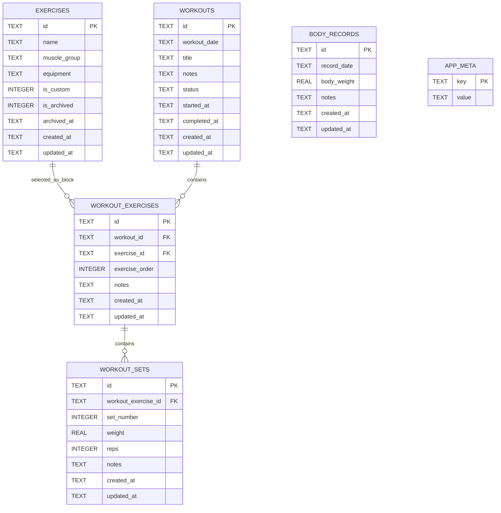

# Gym Progress Tracker — Database Design

**Document Status:** Revised Draft  
**Source Requirement:** Gym Progress Tracker — Requirement Document v1  
**Depends On:** Gym Progress Tracker — System Design  
**Target Version:** Version 1 MVP  
**Target Platform:** Android standalone APK  
**Database:** SQLite  
**Date:** 2026-07-05

---

## 1. Purpose

This document defines the revised local SQLite database design for **Gym Progress Tracker v1**.

The database must support:

- Offline workout tracking.
- Fast set recording during gym sessions.
- Immediate saving after each set.
- Workout history.
- Exercise progress history.
- Repeated exercise blocks inside the same workout.
- Bodyweight tracking.
- Safe JSON export/import backup.
- Stable IDs for future backend or sync compatibility.
- Versioned migrations without resetting user data.
- Backup version lifecycle through JSON transformers.

Version 1 is local-only. There is no backend, login, cloud sync, or multi-user data separation.

---

## 2. Corrections from Database Design v1.1

Database Design v1.1 fixed the major architecture problems, but three runtime-level issues remained. makes these corrections:

| Area | v1.1 Weakness | Correction |
|---|---|---|
| Exercise block reorder | Direct swaps can violate immediate `UNIQUE(workout_id, exercise_order)`. | Keep the unique constraint and require positive parking-value reorder transactions. |
| Body records | `UNIQUE(record_date)` was accidentally missing. | Restore one bodyweight record per date at the database level. |
| Set deletion | Deleting Set 2 could leave visible gaps such as `1, 3, 4`. | Require delete-and-resequence inside one safe transaction. |

The v1.1 corrections remain active: backup transformers, historical backup fixtures, single-active-workout partial unique index, immediate write serialization, transactional set insertion, repeated exercise blocks, and `workout_sets` referencing `workout_exercises.id`.

---

## 3. Design Priorities

1. **Data safety**  
   Workout history must not be lost during app updates, failed imports, app restarts, or normal migrations.

2. **Fast writes**  
   Each set must be inserted immediately after the user records it.

3. **Correct workout chronology**  
   Exercise order and repeated exercise blocks must be preserved.

4. **Database-enforced integrity**  
   Critical rules should be enforced by SQLite constraints and indexes, not only by the UI.

5. **Future compatibility**  
   Stable string IDs, timestamps, and versioned backup structures should support future backend sync or schema changes.

---

## 4. Database Overview

### 4.1 Tables

| Table | Purpose |
|---|---|
| `exercises` | Stores default and custom exercises. |
| `workouts` | Stores workout sessions. |
| `workout_exercises` | Stores exercise blocks inside a workout, including chronological order. |
| `workout_sets` | Stores recorded sets for one workout exercise block. |
| `body_records` | Stores bodyweight records. |
| `app_meta` | Stores internal database metadata. |

### 4.2 Main relationships

```text
exercises
  1 ─── * workout_exercises

workouts
  1 ─── * workout_exercises

workout_exercises
  1 ─── * workout_sets

body_records
  independent table

app_meta
  independent internal table
```

### 4.3 Important v1.1 relationship change

`workout_sets` must reference `workout_exercises.id`.

This means a set belongs to a specific exercise block inside a workout, not merely to the pair of workout and exercise.

This supports:

```text
Workout A
1. Bicep Curl
   - Set 1
   - Set 2

2. Tricep Pushdown
   - Set 1
   - Set 2

3. Bicep Curl
   - Set 1
```

The first and third Bicep Curl blocks are separate `workout_exercises` rows.

---

## 5. SQLite Configuration

When the database opens, the app must enable foreign key enforcement.

```sql
PRAGMA foreign_keys = ON;
```

Recommended startup behavior:

```text
Open SQLite database
  ↓
Enable foreign keys
  ↓
Run migrations
  ↓
Seed default exercises idempotently
  ↓
Load app data
```

SQLite stores booleans as integers.

| Meaning | Stored Value |
|---|---:|
| false | `0` |
| true | `1` |

Datetime values should be stored as ISO-8601 strings.

Example:

```text
2026-07-01T10:30:00.000Z
```

User-facing dates should be stored as date-only strings.

Example:

```text
2026-07-01
```

---

## 6. Entity Relationship Diagram



---

## 7. Table Design

## 7.1 `exercises`

### Purpose

Stores all exercises available in the app.

This includes:

- Default exercises seeded by the app.
- Custom exercises created by the user.
- Archived exercises hidden from normal selection but kept for history.

### SQL

```sql
CREATE TABLE exercises (
  id TEXT PRIMARY KEY,
  name TEXT NOT NULL,
  muscle_group TEXT NOT NULL,
  equipment TEXT,
  is_custom INTEGER NOT NULL DEFAULT 0,
  is_archived INTEGER NOT NULL DEFAULT 0,
  archived_at TEXT,
  created_at TEXT NOT NULL,
  updated_at TEXT NOT NULL,
  CHECK (is_custom IN (0, 1)),
  CHECK (is_archived IN (0, 1)),
  CHECK (
    (is_archived = 1 AND archived_at IS NOT NULL)
    OR
    (is_archived = 0 AND archived_at IS NULL)
  )
);
```

### Columns

| Column | Type | Required | Description |
|---|---|---:|---|
| `id` | TEXT | Yes | Stable local exercise ID. |
| `name` | TEXT | Yes | Exercise name. |
| `muscle_group` | TEXT | Yes | Main muscle group. |
| `equipment` | TEXT | No | Machine, dumbbell, cable, bodyweight, etc. |
| `is_custom` | INTEGER | Yes | `1` if created by user. |
| `is_archived` | INTEGER | Yes | `1` if hidden from active selection. |
| `archived_at` | TEXT | No | Filled only when archived. |
| `created_at` | TEXT | Yes | ISO datetime. |
| `updated_at` | TEXT | Yes | ISO datetime. |

### Notes

Default exercises should use stable IDs and be seeded idempotently.

Example:

```text
ex_chest_press_machine
ex_lat_pulldown
ex_seated_row
```

Used exercises must not be permanently deleted. They should be archived instead.

---

## 7.2 `workouts`

### Purpose

Stores workout sessions.

A workout can be:

- `in_progress`
- `completed`

Only one workout may be `in_progress` at a time.

### SQL

```sql
CREATE TABLE workouts (
  id TEXT PRIMARY KEY,
  workout_date TEXT NOT NULL,
  title TEXT,
  notes TEXT,
  status TEXT NOT NULL,
  started_at TEXT NOT NULL,
  completed_at TEXT,
  created_at TEXT NOT NULL,
  updated_at TEXT NOT NULL,
  CHECK (status IN ('in_progress', 'completed')),
  CHECK (
    (status = 'completed' AND completed_at IS NOT NULL)
    OR
    (status = 'in_progress' AND completed_at IS NULL)
  )
);
```

### Partial unique index

```sql
CREATE UNIQUE INDEX IF NOT EXISTS ux_workouts_single_in_progress
ON workouts(status)
WHERE status = 'in_progress';
```

### Columns

| Column | Type | Required | Description |
|---|---|---:|---|
| `id` | TEXT | Yes | Stable local workout ID. |
| `workout_date` | TEXT | Yes | Date-only string. |
| `title` | TEXT | No | Optional workout title. |
| `notes` | TEXT | No | Optional workout notes. |
| `status` | TEXT | Yes | `in_progress` or `completed`. |
| `started_at` | TEXT | Yes | ISO datetime. |
| `completed_at` | TEXT | No | ISO datetime when completed. |
| `created_at` | TEXT | Yes | ISO datetime. |
| `updated_at` | TEXT | Yes | ISO datetime. |

### Repository rule for double-tap start

If creating a workout fails because of `ux_workouts_single_in_progress`, the repository must not crash the UI.

Required behavior:

```text
Catch SQLITE_CONSTRAINT_UNIQUE
  ↓
Check whether it came from the single active workout rule
  ↓
Query current in_progress workout
  ↓
Return existing workout to the UI
```

---

## 7.3 `workout_exercises`

### Purpose

Stores exercise blocks inside a workout.

This table solves three problems:

1. An exercise can be added before any set exists.
2. Exercise order inside the workout is preserved.
3. The same exercise can appear multiple times in one workout.

### SQL

```sql
CREATE TABLE workout_exercises (
  id TEXT PRIMARY KEY,
  workout_id TEXT NOT NULL,
  exercise_id TEXT NOT NULL,
  exercise_order INTEGER NOT NULL,
  notes TEXT,
  created_at TEXT NOT NULL,
  updated_at TEXT NOT NULL,
  FOREIGN KEY (workout_id) REFERENCES workouts(id) ON DELETE CASCADE,
  FOREIGN KEY (exercise_id) REFERENCES exercises(id) ON DELETE RESTRICT,
  CHECK (exercise_order > 0),
  UNIQUE (workout_id, exercise_order)
);
```

### Columns

| Column | Type | Required | Description |
|---|---|---:|---|
| `id` | TEXT | Yes | Stable local workout exercise block ID. |
| `workout_id` | TEXT | Yes | Parent workout. |
| `exercise_id` | TEXT | Yes | Selected exercise. |
| `exercise_order` | INTEGER | Yes | Order inside workout. |
| `notes` | TEXT | No | Optional notes for this exercise block. |
| `created_at` | TEXT | Yes | ISO datetime. |
| `updated_at` | TEXT | Yes | ISO datetime. |

### Important constraint decision

Do **not** add this constraint:

```sql
UNIQUE (workout_id, exercise_id)
```

That would block repeated exercise blocks and make chronological review weaker.

Correct uniqueness rule:

```sql
UNIQUE (workout_id, exercise_order)
```

---

## 7.4 `workout_sets`

### Purpose

Stores the actual set records for each exercise block inside a workout.

### SQL

```sql
CREATE TABLE workout_sets (
  id TEXT PRIMARY KEY,
  workout_exercise_id TEXT NOT NULL,
  set_number INTEGER NOT NULL,
  weight REAL NOT NULL,
  reps INTEGER NOT NULL,
  notes TEXT,
  created_at TEXT NOT NULL,
  updated_at TEXT NOT NULL,
  FOREIGN KEY (workout_exercise_id) REFERENCES workout_exercises(id) ON DELETE CASCADE,
  CHECK (set_number > 0),
  CHECK (weight >= 0),
  CHECK (reps > 0),
  UNIQUE (workout_exercise_id, set_number)
);
```

### Columns

| Column | Type | Required | Description |
|---|---|---:|---|
| `id` | TEXT | Yes | Stable local set ID. |
| `workout_exercise_id` | TEXT | Yes | Parent workout exercise block. |
| `set_number` | INTEGER | Yes | Sequential number inside block. |
| `weight` | REAL | Yes | Weight in kilograms. |
| `reps` | INTEGER | Yes | Whole-number repetitions. |
| `notes` | TEXT | No | Optional set note. |
| `created_at` | TEXT | Yes | ISO datetime. |
| `updated_at` | TEXT | Yes | ISO datetime. |

### Important relation decision

`workout_sets` does not need direct `workout_id` and `exercise_id` columns because those can be reached through `workout_exercises`.

Query path:

```text
workout_sets.workout_exercise_id
  → workout_exercises.id
  → workout_exercises.workout_id
  → workout_exercises.exercise_id
```

This avoids data duplication and prevents mismatched workout/exercise references.

---

## 7.5 `body_records`

### Purpose

Stores bodyweight progress records.

### SQL

```sql
CREATE TABLE body_records (
  id TEXT PRIMARY KEY,
  record_date TEXT NOT NULL,
  body_weight REAL NOT NULL,
  notes TEXT,
  created_at TEXT NOT NULL,
  updated_at TEXT NOT NULL,
  CHECK (body_weight > 0),
  UNIQUE (record_date)
);
```

### Columns

| Column | Type | Required | Description |
|---|---|---:|---|
| `id` | TEXT | Yes | Stable local body record ID. |
| `record_date` | TEXT | Yes | Date-only string. |
| `body_weight` | REAL | Yes | Bodyweight in kilograms. |
| `notes` | TEXT | No | Optional notes. |
| `created_at` | TEXT | Yes | ISO datetime. |
| `updated_at` | TEXT | Yes | ISO datetime. |

### Important constraint decision

The app stores only one bodyweight record per calendar date:

```sql
UNIQUE (record_date)
```

If the user enters bodyweight again for the same date, the repository should return the existing record or run an explicit update flow. It must not silently create a duplicate row.

---

## 7.6 `app_meta`

### Purpose

Stores internal application/database metadata.

### SQL

```sql
CREATE TABLE app_meta (
  key TEXT PRIMARY KEY,
  value TEXT NOT NULL
);
```

### Suggested keys

| Key | Example Value | Purpose |
|---|---|---|
| `db_schema_version` | `1` | Current SQLite schema version. |
| `default_exercises_seeded_at` | `2026-07-01T10:00:00.000Z` | Optional seed timestamp. |
| `last_backup_exported_at` | `2026-07-01T10:00:00.000Z` | Optional UI display. |
| `last_backup_imported_at` | `2026-07-01T10:00:00.000Z` | Optional UI display. |

---

## 8. Index Strategy

Indexes should support common app reads without over-indexing the MVP.

```sql
CREATE INDEX IF NOT EXISTS idx_exercises_muscle_group
ON exercises(muscle_group);

CREATE INDEX IF NOT EXISTS idx_exercises_archived
ON exercises(is_archived);

CREATE INDEX IF NOT EXISTS idx_workouts_date
ON workouts(workout_date DESC);

CREATE UNIQUE INDEX IF NOT EXISTS ux_workouts_single_in_progress
ON workouts(status)
WHERE status = 'in_progress';

CREATE INDEX IF NOT EXISTS idx_workout_exercises_workout_order
ON workout_exercises(workout_id, exercise_order);

CREATE INDEX IF NOT EXISTS idx_workout_exercises_exercise
ON workout_exercises(exercise_id);

CREATE INDEX IF NOT EXISTS idx_workout_sets_workout_exercise
ON workout_sets(workout_exercise_id, set_number);

CREATE INDEX IF NOT EXISTS idx_body_records_date
ON body_records(record_date DESC);
```

### Why the partial unique index is required

The app can use a service-layer check to find an active workout before creating a new one, but that is not enough.

Double-tap and concurrent UI actions can still create two insert attempts.

The partial unique index makes SQLite enforce the rule permanently:

```text
Only one row where status = 'in_progress'
```

---

## 9. Initial Migration: `001_initial_schema`

The first migration should create all tables and indexes.

```sql
PRAGMA foreign_keys = ON;

CREATE TABLE IF NOT EXISTS exercises (
  id TEXT PRIMARY KEY,
  name TEXT NOT NULL,
  muscle_group TEXT NOT NULL,
  equipment TEXT,
  is_custom INTEGER NOT NULL DEFAULT 0,
  is_archived INTEGER NOT NULL DEFAULT 0,
  archived_at TEXT,
  created_at TEXT NOT NULL,
  updated_at TEXT NOT NULL,
  CHECK (is_custom IN (0, 1)),
  CHECK (is_archived IN (0, 1)),
  CHECK (
    (is_archived = 1 AND archived_at IS NOT NULL)
    OR
    (is_archived = 0 AND archived_at IS NULL)
  )
);

CREATE TABLE IF NOT EXISTS workouts (
  id TEXT PRIMARY KEY,
  workout_date TEXT NOT NULL,
  title TEXT,
  notes TEXT,
  status TEXT NOT NULL,
  started_at TEXT NOT NULL,
  completed_at TEXT,
  created_at TEXT NOT NULL,
  updated_at TEXT NOT NULL,
  CHECK (status IN ('in_progress', 'completed')),
  CHECK (
    (status = 'completed' AND completed_at IS NOT NULL)
    OR
    (status = 'in_progress' AND completed_at IS NULL)
  )
);

CREATE TABLE IF NOT EXISTS workout_exercises (
  id TEXT PRIMARY KEY,
  workout_id TEXT NOT NULL,
  exercise_id TEXT NOT NULL,
  exercise_order INTEGER NOT NULL,
  notes TEXT,
  created_at TEXT NOT NULL,
  updated_at TEXT NOT NULL,
  FOREIGN KEY (workout_id) REFERENCES workouts(id) ON DELETE CASCADE,
  FOREIGN KEY (exercise_id) REFERENCES exercises(id) ON DELETE RESTRICT,
  CHECK (exercise_order > 0),
  UNIQUE (workout_id, exercise_order)
);

CREATE TABLE IF NOT EXISTS workout_sets (
  id TEXT PRIMARY KEY,
  workout_exercise_id TEXT NOT NULL,
  set_number INTEGER NOT NULL,
  weight REAL NOT NULL,
  reps INTEGER NOT NULL,
  notes TEXT,
  created_at TEXT NOT NULL,
  updated_at TEXT NOT NULL,
  FOREIGN KEY (workout_exercise_id) REFERENCES workout_exercises(id) ON DELETE CASCADE,
  CHECK (set_number > 0),
  CHECK (weight >= 0),
  CHECK (reps > 0),
  UNIQUE (workout_exercise_id, set_number)
);

CREATE TABLE IF NOT EXISTS body_records (
  id TEXT PRIMARY KEY,
  record_date TEXT NOT NULL,
  body_weight REAL NOT NULL,
  notes TEXT,
  created_at TEXT NOT NULL,
  updated_at TEXT NOT NULL,
  CHECK (body_weight > 0),
  UNIQUE (record_date)
);

CREATE TABLE IF NOT EXISTS app_meta (
  key TEXT PRIMARY KEY,
  value TEXT NOT NULL
);

CREATE INDEX IF NOT EXISTS idx_exercises_muscle_group
ON exercises(muscle_group);

CREATE INDEX IF NOT EXISTS idx_exercises_archived
ON exercises(is_archived);

CREATE INDEX IF NOT EXISTS idx_workouts_date
ON workouts(workout_date DESC);

CREATE UNIQUE INDEX IF NOT EXISTS ux_workouts_single_in_progress
ON workouts(status)
WHERE status = 'in_progress';

CREATE INDEX IF NOT EXISTS idx_workout_exercises_workout_order
ON workout_exercises(workout_id, exercise_order);

CREATE INDEX IF NOT EXISTS idx_workout_exercises_exercise
ON workout_exercises(exercise_id);

CREATE INDEX IF NOT EXISTS idx_workout_sets_workout_exercise
ON workout_sets(workout_exercise_id, set_number);

CREATE INDEX IF NOT EXISTS idx_body_records_date
ON body_records(record_date DESC);

INSERT OR REPLACE INTO app_meta (key, value)
VALUES ('db_schema_version', '1');
```

---

## 10. Default Exercise Seed Data

Default exercises should be inserted idempotently using stable IDs.

Example:

```sql
INSERT OR IGNORE INTO exercises (
  id,
  name,
  muscle_group,
  equipment,
  is_custom,
  is_archived,
  archived_at,
  created_at,
  updated_at
) VALUES (?, ?, ?, ?, 0, 0, NULL, ?, ?);
```

### Suggested default exercises

| ID | Name | Muscle Group | Equipment |
|---|---|---|---|
| `ex_chest_press_machine` | Chest Press Machine | Chest | Machine |
| `ex_lat_pulldown` | Lat Pulldown | Back | Cable Machine |
| `ex_seated_row` | Seated Row | Back | Cable Machine |
| `ex_leg_press` | Leg Press | Legs | Machine |
| `ex_shoulder_press_machine` | Shoulder Press Machine | Shoulder | Machine |
| `ex_lateral_raise` | Lateral Raise | Shoulder | Dumbbell |
| `ex_bicep_curl` | Bicep Curl | Biceps | Dumbbell |
| `ex_tricep_pushdown` | Tricep Pushdown | Triceps | Cable Machine |
| `ex_leg_extension` | Leg Extension | Legs | Machine |
| `ex_leg_curl` | Leg Curl | Legs | Machine |

---

## 11. ID Strategy

Main records must use stable string IDs or UUID-style IDs.

Recommended prefixes:

| Entity | Prefix | Example |
|---|---|---|
| Exercise | `ex_` | `ex_lat_pulldown` |
| Workout | `wo_` | `wo_k8d2a9f1` |
| Workout Exercise | `wex_` | `wex_b7c12d9e` |
| Workout Set | `set_` | `set_f83ca2d1` |
| Body Record | `br_` | `br_9a77c1e4` |

Rules:

- IDs should be generated in app code before insert.
- IDs should not depend on SQLite auto-increment values.
- Export/import must preserve IDs.
- Default exercise IDs must be stable and human-readable.

---

## 12. Repository Design

Repositories should hide SQL details from services and screens.

### 12.1 Workout repository

Suggested functions:

```ts
type WorkoutRepository = {
  findActiveWorkout(): Promise<Workout | null>;
  createWorkout(input: CreateWorkoutInput): Promise<Workout>;
  getOrCreateActiveWorkout(input: CreateWorkoutInput): Promise<Workout>;
  completeWorkout(workoutId: string): Promise<void>;
  updateWorkout(input: UpdateWorkoutInput): Promise<void>;
  deleteWorkout(workoutId: string): Promise<void>;
  findWorkoutHistory(): Promise<WorkoutSummary[]>;
  findWorkoutDetail(workoutId: string): Promise<WorkoutDetail | null>;
};
```

### `getOrCreateActiveWorkout()` behavior

```text
1. Query existing in_progress workout.
2. If found, return it.
3. If not found, try to insert a new in_progress workout.
4. If insert succeeds, return it.
5. If insert fails because ux_workouts_single_in_progress already exists:
   - query existing in_progress workout
   - return it
6. If another error occurs, return a controlled repository error.
```

---

## 12.2 Workout exercise repository

Suggested functions:

```ts
type WorkoutExerciseRepository = {
  addExerciseBlock(input: AddExerciseBlockInput): Promise<WorkoutExercise>;
  findLatestExerciseBlock(workoutId: string, exerciseId: string): Promise<WorkoutExercise | null>;
  addExerciseOrFocusLatest(input: AddExerciseInput): Promise<AddExerciseResult>;
  moveExerciseBlock(input: MoveExerciseBlockInput): Promise<void>;
  removeExerciseBlock(workoutExerciseId: string): Promise<void>;
};
```

### Add exercise behavior

Default beginner-friendly behavior:

```text
If exercise does not exist in workout:
  append new block

If exercise already exists in workout:
  focus latest block
  show optional "Add again" action
```

### Add again behavior

```text
Append new workout_exercises row
Use same exercise_id
Use new exercise_order
Return new workout_exercise_id
```

### Required `moveExerciseBlock()` transaction

`moveExerciseBlock()` must not directly swap two used `exercise_order` values because SQLite enforces `UNIQUE(workout_id, exercise_order)` immediately.

Required flow:

```text
BEGIN TRANSACTION
  SELECT all workout_exercises for workout_id ordered by exercise_order
  Build final order in memory
  UPDATE affected rows to temporary positive parking orders
  UPDATE affected rows to final compact positive orders
COMMIT
```

Example:

```text
Initial: A = 1, B = 2
Parking: A = 1000001, B = 1000002
Final:   A = 2, B = 1
```

Temporary values must be positive because the schema enforces `CHECK (exercise_order > 0)`. After commit, `exercise_order` values should be compact: `1, 2, 3, ...`.

---

## 12.3 Workout set repository

Suggested functions:

```ts
type WorkoutSetRepository = {
  addSet(input: AddSetInput): Promise<WorkoutSet>;
  updateSet(input: UpdateSetInput): Promise<void>;
  deleteSet(setId: string): Promise<void>;
  findSetsByWorkoutExercise(workoutExerciseId: string): Promise<WorkoutSet[]>;
};
```

### Required `addSet()` transaction

Set insertion must not perform `MAX(set_number) + 1` outside the insert transaction.

Required flow:

```text
WorkoutWriteQueue.enqueue(() =>
  db.transaction(() =>
    nextSetNumber = SELECT COALESCE(MAX(set_number), 0) + 1
                    FROM workout_sets
                    WHERE workout_exercise_id = ?

    INSERT workout_sets with nextSetNumber
  )
)
```

Required properties:

- Queue only serializes immediate writes.
- Queue does not batch or delay workout writes.
- Read and insert happen inside the same explicit transaction.
- UI treats the set as saved only after transaction commit.
- Unique constraint remains as the final guard.

---

## 12.4 Exercise repository

Suggested functions:

```ts
type ExerciseRepository = {
  findAllActiveExercises(): Promise<Exercise[]>;
  findExercisesByMuscleGroup(muscleGroup: string): Promise<Exercise[]>;
  createCustomExercise(input: CreateExerciseInput): Promise<Exercise>;
  updateCustomExercise(input: UpdateExerciseInput): Promise<void>;
  deleteUnusedCustomExercise(exerciseId: string): Promise<void>;
  archiveUsedExercise(exerciseId: string): Promise<void>;
  hasWorkoutHistory(exerciseId: string): Promise<boolean>;
};
```

### Used exercise check

`hasWorkoutHistory()` should check `workout_exercises`, not `workout_sets`, because an exercise may be added to a workout before sets exist.

```sql
SELECT EXISTS (
  SELECT 1
  FROM workout_exercises
  WHERE exercise_id = ?
) AS has_history;
```

---

## 12.5 Body record repository

Suggested functions:

```ts
type BodyRecordRepository = {
  createBodyRecord(input: CreateBodyRecordInput): Promise<BodyRecord>;
  updateBodyRecord(input: UpdateBodyRecordInput): Promise<void>;
  deleteBodyRecord(bodyRecordId: string): Promise<void>;
  findBodyRecordHistory(): Promise<BodyRecord[]>;
  findLatestBodyRecord(): Promise<BodyRecord | null>;
};
```

---

## 13. Write Queue Design

The `WorkoutWriteQueue` exists to prevent multiple workout writes from running at the same time in the JavaScript process.

### Correct use

```text
Good:
- serialize immediate write promises
- run each write as soon as it reaches the front
- wait for SQLite commit
- then resolve the UI action
```

### Incorrect use

```text
Bad:
- collect sets in memory
- delay writes for batching
- show unsaved sets as saved
- flush writes later when app is idle
```

### Reason

Mobile operating systems can suspend or kill the app after it goes to the background. Any pending unsaved writes in JavaScript memory can be lost.

Therefore, the write queue is a concurrency control tool, not a delayed persistence mechanism.

---

## 14. Backup Export Format

### 14.1 Envelope

```ts
type BackupEnvelope = {
  app_name: "Gym Progress Tracker";
  backup_version: number;
  app_schema_version: number;
  exported_at: string;
  exported_app_version?: string;
  data: BackupData;
};
```

### 14.2 Current version

```text
current_backup_version = 1
current_app_schema_version = 1
```

### 14.3 Backup data

```ts
type BackupData = {
  exercises: ExerciseBackupRow[];
  workouts: WorkoutBackupRow[];
  workout_exercises: WorkoutExerciseBackupRow[];
  workout_sets: WorkoutSetBackupRow[];
  body_records: BodyRecordBackupRow[];
};
```

### 14.4 Example backup

```json
{
  "app_name": "Gym Progress Tracker",
  "backup_version": 1,
  "app_schema_version": 1,
  "exported_at": "2026-07-01T10:00:00.000Z",
  "exported_app_version": "1.0.0",
  "data": {
    "exercises": [],
    "workouts": [],
    "workout_exercises": [],
    "workout_sets": [],
    "body_records": []
  }
}
```

---

## 15. Backup Import Lifecycle

### 15.1 Import version handling

Import must support older backup versions when a transformer exists.

```text
If backup_version > current_backup_version:
  reject as newer unsupported backup

If backup_version === current_backup_version:
  validate directly

If backup_version < current_backup_version:
  run transformer chain until current backup version
  validate transformed result
```

### 15.2 Transformer chain

Future example:

```text
backup v1 → v1ToV2() → backup v2 → v2ToV3() → backup v3
```

Rules:

- Transformers are pure functions.
- Transformers do not write to SQLite.
- Transformers must be unit tested.
- Every previous backup version must have fixtures.

### 15.3 Mandatory backup fixtures

Required for v1.1:

```text
src/features/backup/fixtures/
  backup-v1-valid.json
  backup-v1-invalid-multiple-active-workouts.json
```

When v2 is introduced:

```text
  backup-v2-valid.json
  backup-v2-invalid.json
```

Testing requirement:

```text
Every release must run historical backup fixture tests.
Older valid backups must not break silently.
```

---

## 16. Backup Import Validation

Before replacing local data, the app must validate the transformed backup.

### Required validation

- Valid JSON.
- `app_name` must match `Gym Progress Tracker`.
- `backup_version` must be supported or transformable.
- `app_schema_version` must exist.
- Required data sections must exist.
- All IDs must be non-empty strings.
- Timestamps must be valid strings.
- `workouts.status` must be `in_progress` or `completed`.
- At most one workout may be `in_progress`.
- `completed_at` rules must be valid.
- Each `workout_exercises.workout_id` must reference an existing workout.
- Each `workout_exercises.exercise_id` must reference an existing exercise.
- Each `workout_sets.workout_exercise_id` must reference an existing workout exercise block.
- Each `workout_sets.set_number` must be unique inside its workout exercise block.
- Bodyweight must be greater than zero.
- Weight must be zero or greater.
- Reps must be greater than zero.

### Import rejection cases

Reject before transaction if:

- Backup contains multiple `in_progress` workouts.
- Backup references missing IDs.
- Backup contains duplicate primary IDs.
- Backup contains duplicate `exercise_order` inside one workout.
- Backup contains duplicate `set_number` inside one exercise block.
- Backup version is newer than the app supports.
- Backup version is older but no transformer exists.

---

## 17. Replace-Style Import Transaction

Version 1 supports replace-style import only.

### Transaction flow

```sql
BEGIN TRANSACTION;

DELETE FROM workout_sets;
DELETE FROM workout_exercises;
DELETE FROM workouts;
DELETE FROM body_records;
DELETE FROM exercises;

-- Insert transformed and validated backup rows in dependency order.
-- 1. exercises
-- 2. workouts
-- 3. workout_exercises
-- 4. workout_sets
-- 5. body_records

COMMIT;
```

If any insert fails:

```sql
ROLLBACK;
```

### Required behavior

- Existing local data must remain unchanged if import fails.
- The app must recommend exporting current data before importing.
- The app must show a confirmation warning before replacing data.
- The app must not run partial replace outside a transaction.

---

## 18. Common Queries

### 18.1 Find active workout

```sql
SELECT *
FROM workouts
WHERE status = 'in_progress'
LIMIT 1;
```

### 18.2 Workout history newest first

```sql
SELECT
  w.*,
  COUNT(DISTINCT we.id) AS exercise_count,
  COUNT(ws.id) AS set_count
FROM workouts w
LEFT JOIN workout_exercises we ON we.workout_id = w.id
LEFT JOIN workout_sets ws ON ws.workout_exercise_id = we.id
WHERE w.status = 'completed'
GROUP BY w.id
ORDER BY w.workout_date DESC, w.started_at DESC;
```

### 18.3 Workout detail

```sql
SELECT
  we.id AS workout_exercise_id,
  we.exercise_order,
  we.notes AS workout_exercise_notes,
  e.id AS exercise_id,
  e.name AS exercise_name,
  e.muscle_group,
  ws.id AS set_id,
  ws.set_number,
  ws.weight,
  ws.reps,
  ws.notes AS set_notes
FROM workout_exercises we
JOIN exercises e ON e.id = we.exercise_id
LEFT JOIN workout_sets ws ON ws.workout_exercise_id = we.id
WHERE we.workout_id = ?
ORDER BY we.exercise_order ASC, ws.set_number ASC;
```

### 18.4 Latest block for same exercise in workout

```sql
SELECT *
FROM workout_exercises
WHERE workout_id = ?
  AND exercise_id = ?
ORDER BY exercise_order DESC
LIMIT 1;
```

### 18.5 Next exercise order

This read and insert should happen inside one transaction when appending a block.

```sql
SELECT COALESCE(MAX(exercise_order), 0) + 1 AS next_order
FROM workout_exercises
WHERE workout_id = ?;
```

### 18.6 Next set number

This read and insert must happen inside one explicit transaction.

```sql
SELECT COALESCE(MAX(set_number), 0) + 1 AS next_set_number
FROM workout_sets
WHERE workout_exercise_id = ?;
```

### 18.7 Safe set resequencing after delete

```sql
SELECT workout_exercise_id, set_number
FROM workout_sets
WHERE id = ?;

DELETE FROM workout_sets
WHERE id = ?;

SELECT id, set_number
FROM workout_sets
WHERE workout_exercise_id = ?
  AND set_number > ?
ORDER BY set_number ASC;
```

The repository then updates affected rows to positive parking values and finally to compact set numbers.

### 18.8 Body record by date

```sql
SELECT *
FROM body_records
WHERE record_date = ?
LIMIT 1;
```

### 18.9 Exercise history

```sql
SELECT
  w.workout_date,
  w.started_at,
  we.id AS workout_exercise_id,
  we.exercise_order,
  ws.set_number,
  ws.weight,
  ws.reps,
  ws.notes
FROM workout_sets ws
JOIN workout_exercises we ON we.id = ws.workout_exercise_id
JOIN workouts w ON w.id = we.workout_id
WHERE we.exercise_id = ?
  AND w.status = 'completed'
ORDER BY w.workout_date DESC, w.started_at DESC, we.exercise_order ASC, ws.set_number ASC;
```

### 18.10 Best weight for exercise

```sql
SELECT MAX(ws.weight) AS best_weight
FROM workout_sets ws
JOIN workout_exercises we ON we.id = ws.workout_exercise_id
JOIN workouts w ON w.id = we.workout_id
WHERE we.exercise_id = ?
  AND w.status = 'completed';
```

### 18.11 Latest bodyweight record

```sql
SELECT *
FROM body_records
ORDER BY record_date DESC, created_at DESC
LIMIT 1;
```

---

## 19. Validation Rules

### 19.1 Exercise validation

- `name` is required.
- `muscle_group` is required.
- `equipment` is optional.
- `is_custom` must be `0` or `1`.
- `is_archived` must be `0` or `1`.
- `archived_at` must be filled only if `is_archived = 1`.

### 19.2 Workout validation

- `workout_date` is required.
- `status` must be `in_progress` or `completed`.
- Only one workout can be `in_progress`.
- `completed_at` must be filled when status is `completed`.
- `completed_at` must be null when status is `in_progress`.

### 19.3 Workout exercise validation

- `workout_id` must reference an existing workout.
- `exercise_id` must reference an existing exercise.
- `exercise_order` must be greater than zero.
- `exercise_order` must be unique inside the workout.
- Repeated `exercise_id` inside one workout is allowed.

### 19.4 Workout set validation

- `workout_exercise_id` must reference an existing workout exercise block.
- `set_number` must be greater than zero.
- `set_number` must be unique inside the workout exercise block.
- `weight` must be zero or greater.
- `reps` must be greater than zero.
- `reps` must be a whole number.

### 19.5 Body record validation

- `record_date` is required.
- `record_date` must be unique.
- `body_weight` must be greater than zero.
- If a same-date record already exists, the app should update the existing record only through an explicit user action.

---

## 20. Data Deletion Rules

### 20.1 Workout deletion

Deleting a workout should delete related exercise blocks and sets.

Implemented by:

```sql
FOREIGN KEY (workout_id) REFERENCES workouts(id) ON DELETE CASCADE
FOREIGN KEY (workout_exercise_id) REFERENCES workout_exercises(id) ON DELETE CASCADE
```

### 20.2 Exercise deletion

Exercises referenced by `workout_exercises` must not be deleted.

Implemented by:

```sql
FOREIGN KEY (exercise_id) REFERENCES exercises(id) ON DELETE RESTRICT
```

Rules:

```text
If custom exercise has never been used:
  allow permanent delete

If exercise has been used:
  block delete
  allow archive instead
```

### 20.3 Workout set deletion

Deleting a set must resequence remaining sets in the same `workout_exercise_id` so visible set numbers stay compact.

Required result:

```text
Before: 1, 2, 3, 4
Delete: 2
After:  1, 2, 3
```

This must run inside the same transaction as the delete operation.

### 20.4 Body record deletion

Body records are independent and may be deleted after confirmation.

---

## 21. Backup Mapping

### 21.1 Database to backup

| Database Table | Backup Section |
|---|---|
| `exercises` | `data.exercises` |
| `workouts` | `data.workouts` |
| `workout_exercises` | `data.workout_exercises` |
| `workout_sets` | `data.workout_sets` |
| `body_records` | `data.body_records` |

### 21.2 Backup to database insert order

```text
1. exercises
2. workouts
3. workout_exercises
4. workout_sets
5. body_records
```

The order matters because of foreign keys.

---

## 22. Test Checklist

### 22.1 Schema tests

- Tables are created successfully.
- Foreign keys are enabled.
- Partial unique index exists.
- One active workout is allowed.
- Two active workouts are rejected.
- Repeated exercise blocks are allowed.
- Duplicate exercise order in same workout is rejected.
- Duplicate set number in same exercise block is rejected.
- Duplicate body record date is rejected.
- Used exercise delete is restricted.

### 22.2 Repository tests

- `getOrCreateActiveWorkout()` returns existing active workout after unique constraint.
- Adding same exercise defaults to focusing latest existing block.
- Add again creates a new block with new `exercise_order`.
- Add set creates correct next `set_number`.
- Rapid add set calls produce sequential set numbers.
- Delete set resequences remaining set numbers.
- Exercise block reorder uses parking-value transaction.
- Set insert failure does not mark set as saved.
- Used custom exercise is archived instead of deleted.
- Unused custom exercise can be deleted.

### 22.3 Backup tests

- Export includes all required sections.
- Import rejects invalid JSON.
- Import rejects missing envelope fields.
- Import rejects newer backup version.
- Import transforms older backup version when transformer exists.
- Historical backup fixtures import successfully.
- Invalid backup with multiple active workouts is rejected.
- Failed import rolls back and preserves previous data.

### 22.4 Migration tests

- Fresh database migrates to schema version 1.
- Default exercises seed once.
- Running migration again does not duplicate default exercises.
- Future migrations preserve existing workout data.

---

## 23. Known Tradeoffs

### 23.1 Backup transformer maintenance

Maintaining backup transformers becomes more work as the app grows.

Mitigation:

- Keep transformers small and version-to-version.
- Keep historical fixtures in the repository.
- Run backup compatibility tests before release.

### 23.2 Repeated exercise block UI complexity

Allowing repeated exercise blocks makes the database stronger but requires the UI to handle duplicate exercise selection.

Mitigation:

```text
Default: focus latest existing block
Optional: Add again
```

### 23.3 Transaction complexity

Set insertion becomes more complex because `MAX(set_number) + 1` must run inside the same transaction as insert.

Mitigation:

- Hide this inside repository code.
- Use `WorkoutWriteQueue` only for immediate serialization.
- Keep the UI simple.

### 23.4 Reorder and resequence complexity

Exercise block reordering and set deletion resequencing cannot use naive direct updates because unique constraints are immediate.

Mitigation:

- Keep the unique constraints.
- Use positive parking values inside one transaction.
- Keep final visible order compact and sequential.
- Test rollback behavior.

### 23.5 One bodyweight record per date

One record per date is simpler for v1 bodyweight history and future charts.

Mitigation:

- Use `UNIQUE(record_date)`.
- Ask the user whether to update the existing record when they enter a second value for the same date.

---

## 24. Conclusion

Database Design is a stronger foundation than v1.1 because it fixes additional runtime integrity traps before UI design depends on them.

The most important improvements are:

- Single active workout enforced by a partial unique index.
- Set numbering protected by immediate write serialization and explicit transactions.
- `workout_sets` linked to `workout_exercises` for better relational correctness.
- Repeated exercise blocks supported through `exercise_order`.
- Safe exercise block reordering using positive parking values.
- Set deletion resequencing using positive parking values.
- Bodyweight records protected by `UNIQUE(record_date)`.
- Backup version lifecycle defined through transformers and historical fixtures.

This schema is still realistic for an offline-first MVP, but it avoids the most likely production data integrity problems.
